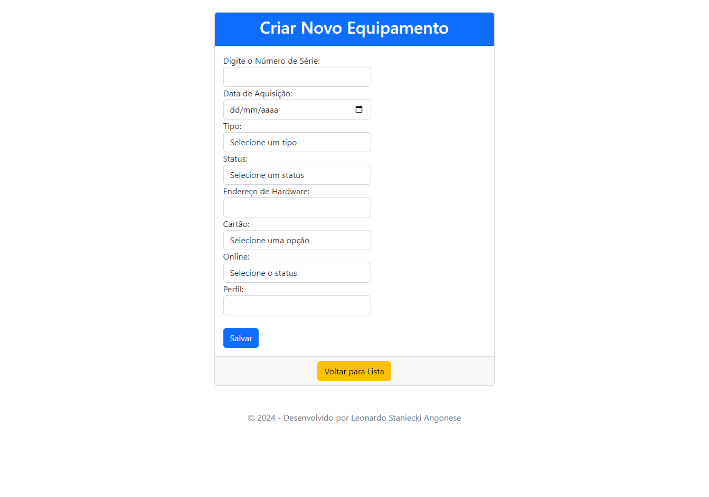
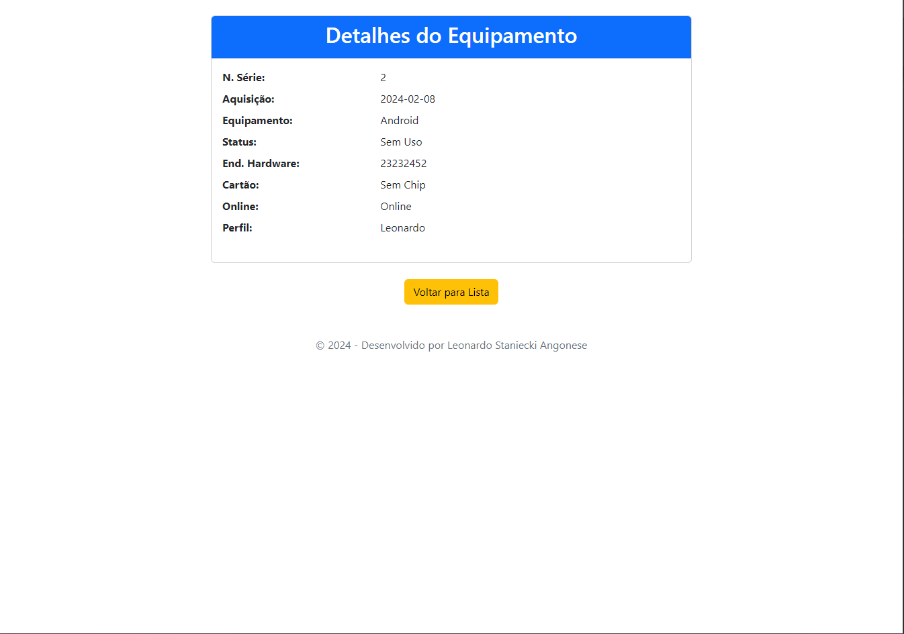
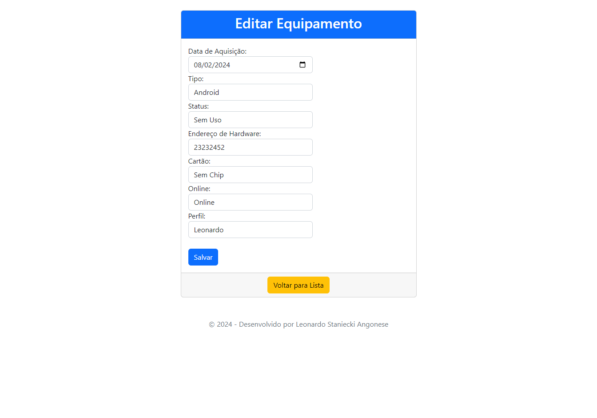
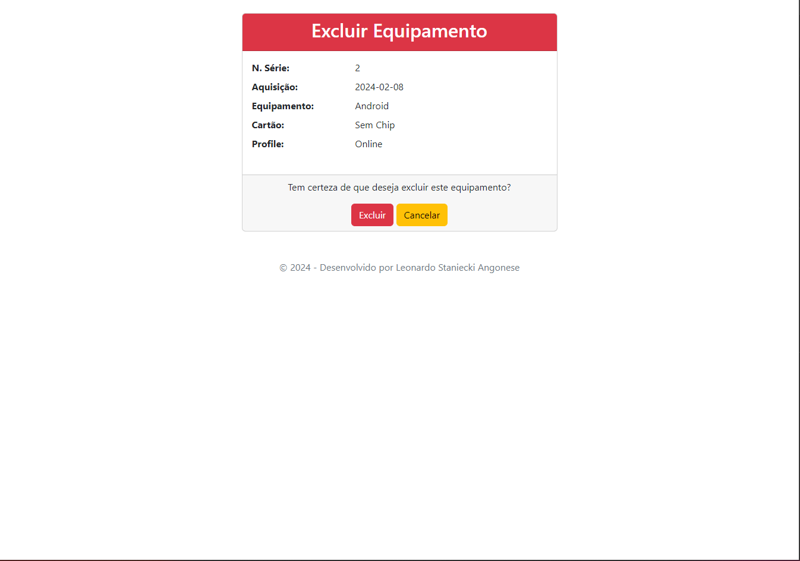

# Projeto de Gerenciamento de Dispositivos.
Este projeto é desenvolvido em ASP.NET MVC, consistindo em quatro telas principais para criar, visualizar e deletar itens. A escolha do ASP.NET MVC foi baseada na facilidade de implementação do padrão MVC (Model-View-Controller) e também com o objetivo de aprimorar conhecimentos. O uso de armazenamento em cache é empregado para otimizar o desempenho e proporcionar uma experiência mais fluida aos usuários.

# Telas






# Instalação

### Pré-requisitos
- [ASP.NET MVC Framework](https://dotnet.microsoft.com/apps/aspnet/mvc) instalado
- Ambiente de desenvolvimento integrado (por exemplo, [Visual Studio](https://visualstudio.microsoft.com/))
- [Pacote .NET SDK](https://dotnet.microsoft.com/download/dotnet) instalado

### Clonando o Repositório
```bash
git clone https://github.com/leoangonese/devicesControl.git
cd phoneController
```
### Restaurando Dependências
```bash
dotnet restore
```
### Inicialização
#### Compilando o Projeto
```bash
dotnet build
```
#### Executando o Projeto
```bash
dotnet start
```

# Tecnologias
- ASP.net MVC 
- JavaScript
- CSS
- BootStrap
- JQuery

Este projeto é uma ótima oportunidade para aprendizado e prática, explorando o desenvolvimento web com ASP.NET MVC e a integração de tecnologias front-end populares. Sinta-se à vontade para contribuir e aprimorar este projeto!
