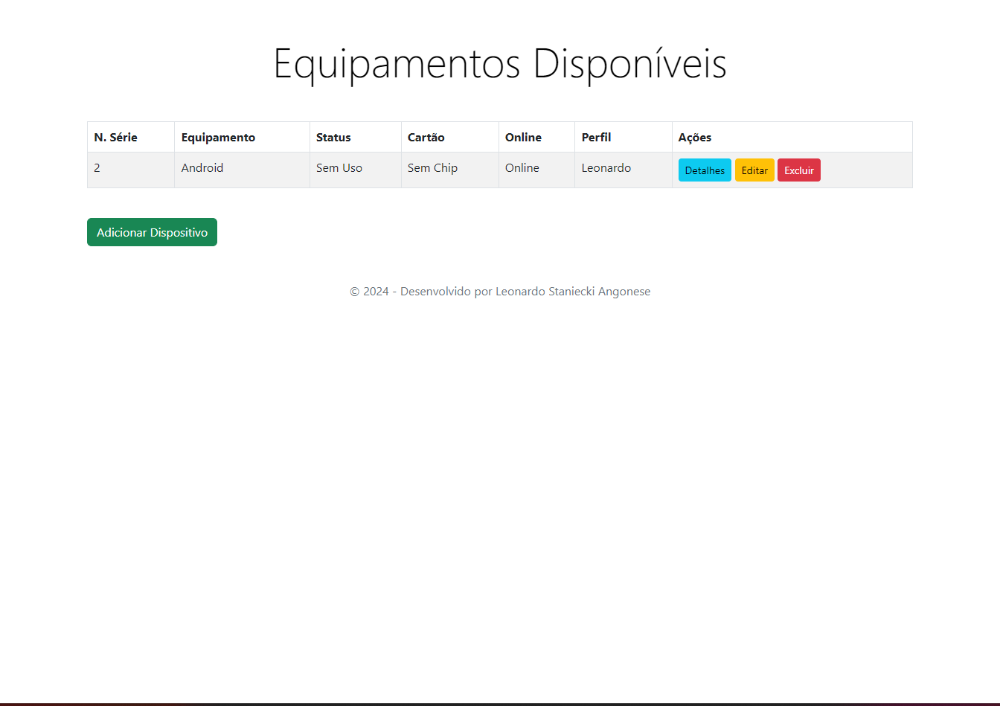

# Projeto de Gerenciamento de Dispositivos.
Esse projeto é feito em ASP.net MVC, onde são 4 telas que é possivel criar um item, visualizar e deletar. Criado em ASP.net pela facilidade do MVC e tambem para estudos, juntamente com o armazenamento em cache para deixar tudo mais fluido

# Telas

[Criação](./src/2.png)
[Detalhes](/src/3.png)
[Editar](/src/4.png)
[Deletar](/src/5.png)

# Instalação
